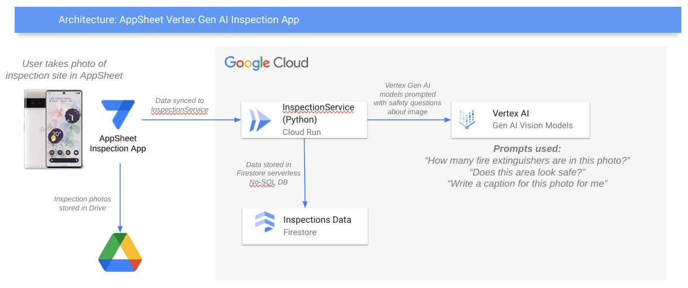

# AppSheet Cloud Inspection Demo

This demo shows how a no-code AppSheet app can use a serverless API deployed in Google Cloud to leverage Gen AI and storage features to enhance a visual inspection scenario.

## Architecture

Here is a high level architecture diagram of the solution.



## Assets deployed

- Cloud Run containerized service written in Python to host the service and API
- A Firestore data collection used to persist the inspection data
- Vertex Gen AI Vision models to ask prompts about inspection photos

## Deploy

To deploy, simply click on this button to start a Google Cloud Shell tutorial to guide you through the deployment steps.

[](https://ssh.cloud.google.com/cloudshell/open?cloudshell_git_repo=https://github.com/tyayers/appsheet-cloud-inspection-demo&cloudshell_git_branch=main&cloudshell_workspace=.&cloudshell_tutorial=docs/tutorial.md)

Or you can also deploy manually by cloning this repo and running these commands:

```bash
# First open the file 1_env.sh and change the variables to your project and region.

# Then set environment variables in your shell
source 1_env.sh

# Now configure your GCP project, service account, and run the deployment
./2_deploy.sh

# Insert a test data record into the Firestore DB so that AppSheet can detect the schema
./3_loaddata.sh

# Test the service by calling this curl command to get test data
SERVICE_URL=$(gcloud run services describe $NAME --platform managed --region $REGION --format 'value(status.url)')
curl "$SERVICE_URL/images"
```

In case you get any errors running the above commands, or if the service doesn't appear to be deployed correctly, create an issue in this repo with the command outputs.

See complete guide to deploying and using the solution in this [community article](https://www.googlecloudcommunity.com/gc/Tips-Tricks/Use-Google-Cloud-Generative-AI-Image-Models-in-AppSheet-as-seen/td-p/629835) on the Google Cloud Community AppSheet site.
